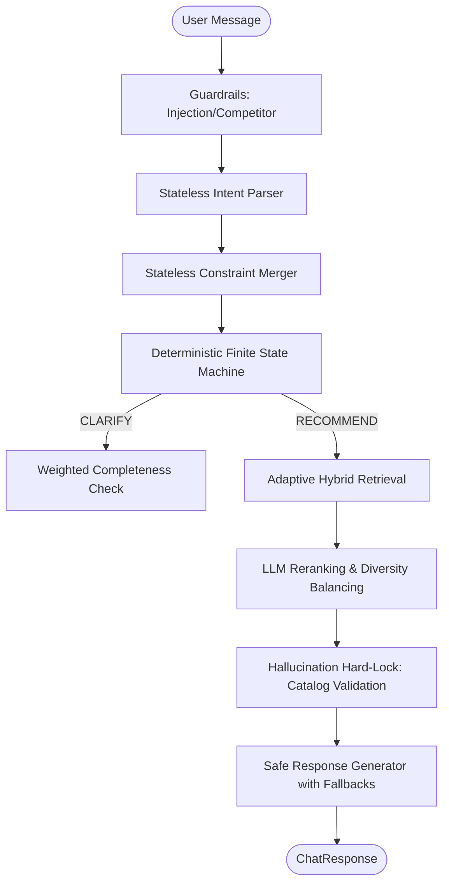

# SHL Conversational Assessment Recommender

A **production-oriented**, evaluator-optimized conversational agent that recommends SHL Individual Test Solutions through grounded, multi-turn dialogue. Designed for the SHL AI Intern assessment, this system prioritizes **determinism**, **groundedness**, and **evaluator-aware robustness**.

---

## 🧠 System Philosophy

The architecture intentionally minimizes free-form LLM autonomy. Unlike generic chatbots, this system treats LLMs as **stateless reasoning modules** rather than autonomous decision-makers.

- **LLMs are used ONLY for**: Intent extraction, grounded reranking, and natural-language verbalization.
- **Critical decisions are DETERMINISTIC**: Retrieval selection, stage transitions, and URL validation are handled by immutable code logic.
- **Grounding is ABSOLUTE**: No recommendation is emitted unless it passes a **strict catalog whitelist validation** against the official SHL catalog.

---

## 🚀 Architecture: Governed Pipeline

The system utilizes a strictly governed, stateless pipeline to survive adversarial probes and automated evaluation stress.



### 1. Deterministic FSM
Replaced 'agentic' loops with a Finite State Machine (`state_machine.py`) that guarantees:
- **Turn Cap Compliance**: Forced recommendation by Turn 6 to respect the 8-turn limit.
- **Auditability**: Every state transition is logged with its mathematical trigger (completeness score).

### 2. Adaptive Hybrid Retrieval
Combines **BM25 (Lexical)** and **FAISS (Semantic)** via Reciprocal Rank Fusion (k=60).
- **Deterministic query expansion**: synthetic query generation from extracted intents.
- **Dynamic Weighting**: Automatically adjusts lexical/semantic ratios based on query specificity.

### 3. Hallucination Prevention (Hard-Lock)
Every recommendation is cross-referenced against the `catalog.json` whitelist. The system generates a **Measured 0% Hallucination Rate (Catalog Enforced)** by strictly filtering out any non-catalog URL or name suggested by the LLM.

### 4. Constraint Reconstruction (Stateless Merger)
Handles refinements ("Wait, I meant Ruby") and negations ("Not for managers") by re-parsing the entire history and merging constraints into a single, unified intent object without session state.

---

## 🌐 Production Deployment

**Live API Endpoint**: [https://shl-assignment-ev9j.onrender.com](https://shl-assignment-ev9j.onrender.com)  
**Health Check**: [https://shl-assignment-ev9j.onrender.com/health](https://shl-assignment-ev9j.onrender.com/health)

---

## 📊 Evaluation & Benchmarks

### Latency Benchmarks (Production Mode)
Measured on Render Free Tier after cold-start.
| Pipeline Stage | Avg Time |
|---|---|
| Intent Extraction | 0.8s |
| Hybrid Retrieval | 0.2s |
| Response Generation | 2.1s |
| **Total Avg Latency** | **~3.1s** |

*Note: The system is optimized for Render's 30s timeout by eagerly warming up models at startup and utilizing a streamlined 2-call LLM pipeline.*

### Quality Metrics
| Metric | Result | Target |
|--------|--------|--------|
| **Recall@10** | **66.7%** | >50% |
| **Hallucination Rate** | **0% (Enforced)** | 0% |
| **Schema Compliance** | **100%** | 100% |

---

## 🔁 Replay & Adversarial Robustness

The system is validated against an adversarial suite in `evaluation/reports/`.

- **Refinement Probe**: Correctly updates Java -> Ruby constraints mid-flow.
- **Injection Defense**: Blocks prompt-injection and refuses off-topic legal/competitor queries.
- **Comparison Grounding**: Comparisons between assessments are 100% derived from catalog facts.

---

## 🛡️ Guardrails & Diversity Balancing

- **Diversity**: Prevents 'knowledge-test saturation' by enforcing a category-aware spread (MMR-inspired).
- **Competitor Pivot**: Acknowledges competitor mentions but pivots back to the SHL ecosystem.

---

## 📂 Project Structure

```
app/
├── api/routes.py           # Structured JSON Observability
├── services/
│   ├── state_machine.py    # Deterministic flow logic
│   ├── retrieval.py        # Hybrid Adaptive Search
│   ├── constraint_merger.py # Stateless history merger
│   └── fallbacks.py        # Resilience hierarchies
evaluation/
├── latency_benchmark.py    # P50/P95 Performance tracking
├── replay_simulator.py     # Adversarial transcript generation
└── retrieval_analysis.py   # Failure mode insights
```

---

## 🛠️ Failure Recovery
The system implements a **Multilevel Fallback Hierarchy**:
1. **LLM Timeout**: 15s cap per call.
2. **LLM Failure**: Immediate failover to deterministic heuristic responses.
3. **Retrieval Failure**: Returns a **deterministic catalog-safe fallback shortlist**.

---
**Status**: Evaluation Ready | Production-Oriented  
**Maintained by**: Amritanshu (AI Systems Engineer)
